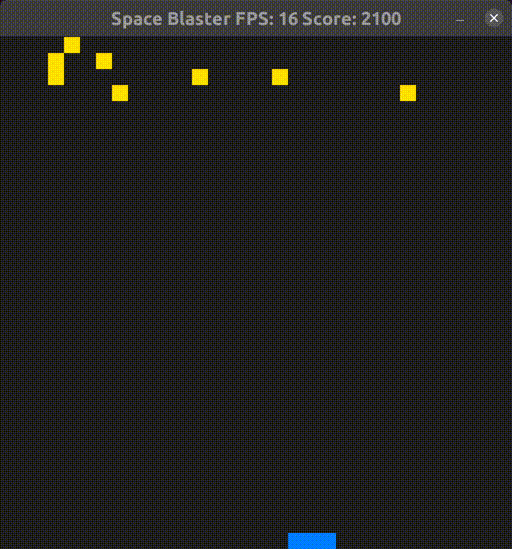

# CPPND: Space Blaster

Space Blaster is my submission for the C++ Nanodegree Capstone project based on Udacity's Snake game. It is written in C++ and 
utilizes the [Simple DirectMedia Layer](https://www.libsdl.org/) library. 

Player's control a ship using the left and right arrow keys. The object of the game is to avoid the space debris. The longer the 
player stays alive, the more their score increases. If a collision occurs with the debris, the game ends.

## Project Structure
* main.cpp
  * Entry point of the game
* game.h/game.cpp
  * Manages the game loop (handling input, rendering, managing the score, etc.)
* window.h/window.cpp
  * Represents a SDL window
  * Sprites are children of the window
* settings.h/settings.cpp
  * Reads game settings from a file or provides defaults
* sprite.h
  * Abstract base class represting sprites in the game
  * Each sprite instance is responsible for drawing itself
  * Sprites can subscribe to other sprite's to provide a mechanism for interaction
* ship.h/ship.cpp
  * Implements the sprite class to represent a ship
  * The ship is a player controlled sprite that can collide with walls and enemies
* enemy.h/enemy.cpp
  * Implements the sprite class to represent an enemy
  * The enemy is a game controlled sprite that can be collided with
* game.settings
  * Provides (some) configurable settings for the game

## Meeting Capstone Requirements
Please note the code references listed below are not exhaustive.

* Loops, Functions, I/O
  * The project demonstrates an understanding of C++ functions and control structures.
    * For loop (game.cpp:20)
    * If block (game.cpp:31)
    * For loop (ship.cpp:48)
    * Function (main.cpp:7)
  * The project reads data from a file and process the data, or the program writes data to a file.
    * File I/O (settings.cpp:22)
  * The project accepts user input and processes the input.
    * Handle keyboard input using the SDL library (game.cpp:76)

* Object Oriented Programming
  * The project uses Object Oriented Programming techniques.
    * game.h/game.cpp
    * sprite.h
    * window.h/window.cpp
    * settings.h/settings.cpp
    * ship.h/ship.cpp
    * enemy.h/enemy.cpp
  * Class constructors utilize member initialization lists.
    * settings.cpp:7
  * Classes encapsulate behavior.
    * window.h/window.cpp
  * Classes follow an appropriate inheritance hierarchy.
    * ship.h/ship.cpp
    * enemy.h/enemy.cpp
  * Derived class functions override virtual base class functions.
    * ship.h
    * enemy.h

* Memory Management
  * The project makes use of references in function declarations.
    * An instance of Settings is passed by reference to the Game constructor (game.cpp:5)
  * The project uses destructors appropriately.
    * window.cpp:30
  * The project follows the Rule of 5.
    * window.h/window.cpp
  * The project uses smart pointers instead of raw pointers.
    * std::shared_ptr (game.cpp:16)
    * std::shared_ptr (game.cpp:21)

## Dependencies for Running Locally
* cmake >= 3.7
  * All OSes: [click here for installation instructions](https://cmake.org/install/)
* make >= 4.1 (Linux, Mac), 3.81 (Windows)
  * Linux: make is installed by default on most Linux distros
  * Mac: [install Xcode command line tools to get make](https://developer.apple.com/xcode/features/)
  * Windows: [Click here for installation instructions](http://gnuwin32.sourceforge.net/packages/make.htm)
* SDL2 >= 2.0
  * All installation instructions can be found [here](https://wiki.libsdl.org/Installation)
  * Note that for Linux, an `apt` or `apt-get` installation is preferred to building from source.
* gcc/g++ >= 5.4
  * Linux: gcc / g++ is installed by default on most Linux distros
  * Mac: same deal as make - [install Xcode command line tools](https://developer.apple.com/xcode/features/)
  * Windows: recommend using [MinGW](http://www.mingw.org/)

## Basic Build Instructions

1. Clone this repo.
2. Make a build directory in the top level directory: `mkdir build && cd build`
3. Compile: `cmake .. && make`
4. Run it: `./SpaceBlaster`.

**IMPORTANT**: Copy the game.settings file into the build directory before starting the SpaceBlaster.